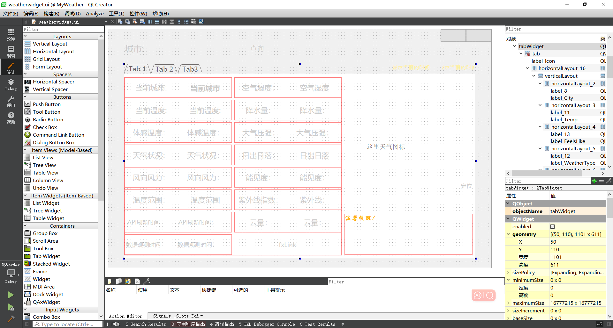
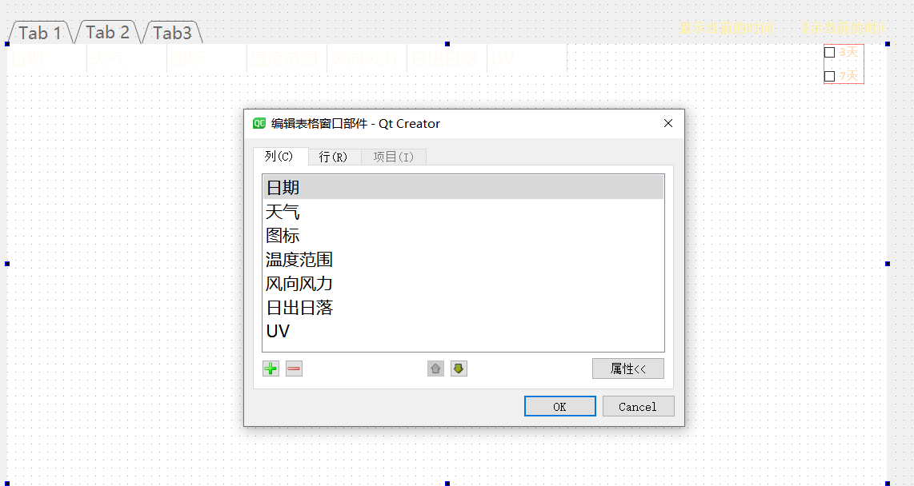

# :white_check_mark:基于Qt框架的天气预报应用开发

**---->>:heavy_check_mark:添加简易音乐播放器模块**:wave:		-------				:+1::point_up_2::star:

## :green_book:1.项目简介

:sunflower:WeatherForecast-MusicPlayer是基于Qt开发，并且未使用除了 C++标准库 和 Qt 之外的第三方库，保证了库的可移植性以及库的纯粹性。

:airplane:通过调⽤IP地址归属地查询API获取当前位置城市，调⽤和⻛天⽓城市搜索API获取该城市的ID,根据ID调⽤和⻛实时天⽓API获取该城市天⽓,使⽤QMap容器存储多⽇天⽓数据。程序中可搜索城市名或者点击定位按钮查询城市近期天⽓,项⽬中使⽤了json数据解析技术,通过定时器获取当前时间。

:musical_note: 音乐模块中通过QHash数据结构存储音乐列表。实现播放暂停、上下曲切换、音量控制、进度条控制、添加音乐、存储音乐列表和通过子线程Thread实时更新当前音乐播放进度的时间显示。

**用到的Qt库有**：

- core 
- gui 
- network
- svg
- multimedia

:grinning:理论上可以部署到任何Qt支持的平台上。:ear_of_rice:

\```

🕙 分享是一种美德，如果帮到你了，还请右上随手点个 🌟 Star，谢谢:wink:

\```

#### IP地址归属地数据查询API

http://whois.pconline.com.cn/ipJson.jsp?ip

#### 和风天气城市搜索API

https://geoapi.qweather.com/v2/city/lookup?location=beij&key=YOUR_KEY 

#### 和风天气实时天气API

https://devapi.qweather.com/v7/weather/now?location=101010100&key=YOUR_KEY

**和风天气每日天气API**

3日：https://devapi.qweather.com/v7/weather/3d?location=101010100&key=YOUR_KEY

7日：https://devapi.qweather.com/v7/weather/7d?location=101010100&key=YOUR_KEY

## :shamrock:2.项目演示

### :beginner:2.1启动界面

启动程序即刷新、当天气数据获取成功时关闭


### :tulip: 2.2今日天气界面

启动时通过ip获取当前城市查询天气

添加了查询、定位按钮、点击跳转网页、温馨提示、天气图标svg格式


### :evergreen_tree:2.3多日天气界面

展示重庆天气


### :musical_note:2.4简易音乐播放器

1. 在无添加时随意点击不会出现程序崩溃

2. 可添加\*.mp3、\*.wav 、\*.wma三种音频格式

	> 有能力的可以继续修改添加QVideoWidget模块播放视频

3. 进度条时间显示的计算我将其放在子线程中实现


## :books:3.文件夹介绍

1. Music：可播放\*.mp3 \*.wav 和\*.wma三种格式的音乐

2. MyWeather：项目代码

	​①Image：资源文件

	​②Icons：天气图标，根据和风天气API调用返回json数据中图标代码来调用

3. Output：可执行程序.exe文件，程序已经打包好，可直接下载安装使用

4. weatherAPP_Release：通过工具windeployqt MyWeather.exe生成的可运行程序

---

# :bookmark_tabs:开发流程文档

需求：编写一款桌面端天气预报应用和音乐播放器。

> 开发环境：
>
> 平台：QT 5.14.2
>
> 构建套件：Desktop_Qt_5_14_2_MinGW_32_bit
>
> 系统：Windows10，理论上可以部署到任何Qt支持的平台上。
>
> 推荐使用Linux系统或者Unix系统

目录结构：


> 学习参考过程中应对照工程文件来进行


开发过程

## :house_with_garden:1.界面设计



### 1.1 设计样式

:fallen_leaf:添加了一些动画效果和透明效果、让界面感觉更"高大尚":joy:

```c++
    this->setWindowTitle("xtc天气");
    this->setWindowFlags(Qt::FramelessWindowHint | Qt::WindowSystemMenuHint | Qt::WindowMinimizeButtonHint);  //窗口为无边框，同时保留系统菜单和最小化按钮

    ui->lineEditCityName->setStyleSheet("QLineEdit{background-color: rgba(255,255,225,0.3);border:none;color:#FFFAF0; border-radius:16px;padding:4px 4px}");   //lineEdit圆角样式
    ui->pushButtonQuery->setStyleSheet("QPushButton::hover{font:24px;}" "QPushButton{background:transparent;color:#FFFAF0}");
    ui->pushButtonLocation->setStyleSheet("QPushButton::hover{font:19px;}" "QPushButton{background:rgba(255,255,225,0.2);color:#FFFAF0;border-radius:16px;padding:5px 5px}");
    ui->btnPause->setIcon(QIcon(":/Image/pause.png"));
    ui->btnAddMusic->setStyleSheet("QPushButton::hover{font:19px;}" "QPushButton{background:rgba(255,255,225,0.2);color:#FFDEAD;border-radius:16px;padding:5px 5px}");

    ui->tabWidget->setCurrentWidget(ui->tab);
    ui->tabWidget->setTabText(0, "今日天气");
    ui->tabWidget->setTabIcon(0, QIcon(":/Image/logo.ico"));
    ui->tabWidget->setTabText(1, "未来天气");
    ui->tabWidget->setTabIcon(1, QIcon(":/Image/weather.png"));
    ui->tabWidget->setTabText(2, "音乐播放");
    ui->tabWidget->setTabIcon(2, QIcon(":/Image/musicicon.png"));
    ui->tabWidget->setStyleSheet("QTabWidget:pane {border-top:0px solid #e8f3f9;background:rgba(255,255,255,0.2); border-radius:16px;padding:4px 4px}"
                                 "QTabBar::tab {background:#2F4F4F;color:#FFA500;font:19px;font-weight:bold;}");

    ui->pushButtonMini->setIcon(QIcon(":/Image/Min.png"));   //最小化按钮
    ui->pushButtonMini->setStyleSheet("QPushButton{border:none;color:rgb(122, 197, 205);}" "QPushButton:hover{background-color: #1E90FF;border:none;color:rgb(255, 255, 255);}");
    ui->pushButtonDestroy->setIcon(QIcon(":/Image/Close.png")); //关闭按钮
    ui->pushButtonDestroy->setStyleSheet("QPushButton{border:none;color:rgb(122, 197, 205);}" "QPushButton:hover{background-color: #FF0000;border:none;color:rgb(255, 255, 255);}");

    ui->tableWidget->setColumnWidth(0, 160);  //添加7列
    ui->tableWidget->setColumnWidth(1, 120);
    ui->tableWidget->setColumnWidth(2, 160);
    ui->tableWidget->setColumnWidth(3, 180);
    ui->tableWidget->setColumnWidth(4, 180);
    ui->tableWidget->setColumnWidth(5, 160);
    ui->tableWidget->setColumnWidth(6, 100);

    ui->tableWidget->setHorizontalScrollBarPolicy(Qt::ScrollBarAlwaysOff); //水平滚动策略 关闭
    ui->tableWidget->setVerticalScrollBarPolicy(Qt::ScrollBarAlwaysOn);//垂直滚动策略
    ui->tableWidget->setShowGrid(false); //无格子线

    //tableWidget表头样式
    ui->tableWidget->horizontalHeader()->setStyleSheet("QHeaderView::section{background:transparent;}");
    ui->tableWidget->verticalHeader()->setVisible(false); //隐藏列表头
    //    ui->tableWidget->horizontalHeader()->setVisible(false); //隐藏行表头
    ui->tableWidget->verticalHeader()->setDefaultSectionSize(75);  //设置行高 （除表头外） setDefaultSectionSize设置默认分段大小
    ui->tableWidget->horizontalHeader()->setFixedHeight(90);  //表头行高
    ui->vSliderVolume->setVisible(false);
    ui->lwMusicList->setHorizontalScrollBarPolicy(Qt::ScrollBarAlwaysOff);//关闭水平滚动条
    movieToLoad(); //加载gif
```

```c++
/**
 * @brief WeatherWidget::movieToLoad
 * 显示一些gif动画效果
 */
void WeatherWidget::movieToLoad() {
    movie = new QMovie(":/Image/movie.gif");   //设置GIF格式背景图
    movie->setScaledSize(QSize(1200, 750));    //设置GIF动画的尺寸与QLabel的尺寸相同
    ui->label_background->setMovie(movie);
    movie->start();
    
    ui->label_cover->raise();// 将 label 显示在最上面 启动图
    movie2 = new QMovie(":/Image/move3.gif");
    movie2->setScaledSize(QSize(1200, 750)); // 设置GIF动画的尺寸与QLabel的尺寸相同
    ui->label_cover->setMovie(movie2);
    movie2->start();
    movie3 = new QMovie(":/Image/haimianbaby.gif"); //界面美化用
    movie3->setScaledSize(QSize(55, 60)); // 设置GIF动画的尺寸与QLabel的尺寸相同
    ui->label_haimianbaby->setMovie(movie3);
    movie3->start();
    movie4 = new QMovie(":/Image/paidaxing.gif");	//界面美化用
    movie4->setScaledSize(QSize(55, 60)); // 设置GIF动画的尺寸与QLabel的尺寸相同
    ui->label_paidaxing->setMovie(movie4);
    movie4->start();
}
```


### 1.2 获取当前时间

添加一个定时器、每1000ms更新一次时间

```c++
    timer = new QTimer(this);  //定时器显示获取当前时间
    connect(timer, &QTimer::timeout, this, &WeatherWidget::updateCurrent);
    timer->start(1000);
```

时间显示

```c++
void WeatherWidget::updateCurrent() {
    QDateTime currentTime = QDateTime::currentDateTime();
    QString nowDate = currentTime.toString("yyyy-MM-dd dddd");
    QString nowTime = currentTime.toString("hh:mm:ss");
    ui->label_currentTime->setText(nowTime);
    ui->label_currentDate->setText(nowDate);
}
```

### 1.3 窗口无边框、鼠标按住widget拖动

> 类似联想电脑管家窗口

设置窗口无边框、保留最小化按钮

```c++
this->setWindowFlags(Qt::FramelessWindowHint | Qt::WindowSystemMenuHint | Qt::WindowMinimizeButtonHint); 
```

#### 1.3.1鼠标拖动

鼠标按住Widget主窗口的任意位置，可以拖动窗口

声明：

```c++
private:
    QPoint startPos;//鼠标点击时的全局位置
    QPoint startPos1;//鼠标点击时的相对位置
    void mousePressEvent(QMouseEvent *event);//鼠标点击
    void mouseMoveEvent(QMouseEvent *event);//鼠标追踪
```

当鼠标按下时获取整个屏幕的全局坐标和相对于Widget的坐标

```c++
//记录拖动起始位置
void WeatherWidget::mousePressEvent(QMouseEvent *event) {
    startPos = event->globalPos();//获取点击鼠标时的全局坐标
    startPos1 = event->pos();//获取点击鼠标的相对WeatherWidget窗口的坐标
}
```

鼠标移动，如果左键按下，

​	计算鼠标现在全局窗口相对于移动前的全局窗口位置，如果鼠标移动manhattanLength像素距离大于4才执行移动。

​	现在的全局位置 减去 移动初的相对于widget的相对位置则为现在的窗口移动后的位置。this->move(event->globalPos() - startPos1);

```c++
//窗口移动
void WeatherWidget::mouseMoveEvent(QMouseEvent *event) {
    if (event->buttons() & Qt::LeftButton) { //判断是否是左键按下
        QPoint movePos = event->globalPos() - startPos;//计算鼠标移动位置
        if ( movePos.manhattanLength() > 4) //判断移动像素距离，防抖动
            this->move(event->globalPos() - startPos1);
        return;
    }
}
```


#### 1.3.2最小化和关闭按钮

```c++
/**
 * @brief WeatherWidget::on_pushButtonMini_clicked
 *  窗口最小化按钮
 */
void WeatherWidget::on_pushButtonMini_clicked() {
    showMinimized();
    //showMaximized();//最大化
}
/**
 * @brief WeatherWidget::on_pushButtonDestroy_clicked
 * 窗口关闭按钮
 */
void WeatherWidget::on_pushButtonDestroy_clicked() {
    this->close();
}
```

### 1.4 设计图标软件显示图标

需要在.pro中添加上需要设置的图标名称

```c++
RC_ICONS = logo.ico
```

图标的后缀格式必须为.ico

将图片添加到项目的和工程文件.pro同级的目录下。

1.5 添加资源文件


如果运行报错如下：

```c++
  cc1plus.exe: out of memory allocating 1073745919 bytes
```

 使用qrc资源文件，也就是在QT的工程中添加资源文件，就是添加的资源文件（如qrc.cpp）会直接**被存放到静态数组**中，

从而一直占用内存，使内存的利用率不高。 有的时候如果资源过大，可能编译都无法通过，会造成out of memory的错误。

解决办法：
  在工程PRO文件中，添加：

```c++
  CONFIG += resources_big
```

扩大资源文件

## :sunrise_over_mountains:2.Weather类请求天气数据

 需要在.pro文件中注册相应的模块

network必须要添加、否则不能使用

```c++
QT       += core gui network
```

使用的主要模块

```c++
#include <QNetworkAccessManager>
#include <QNetworkRequest>
#include <QNetworkReply>
#include <QTextCodec>
#include <QDebug>
#include <QJsonParseError>
#include <QJsonDocument>
#include <QJsonObject>
#include <QJsonArray>   //json数组
```

> 以下所有的成员、方法都需要在class类里面声明

```c++
QNetworkAccessManager *netManager;
```

new一个网络管家

```c++
netManager = new QNetworkAccessManager(this);  //新建QNetworkAccessManager对象
```

### 2.1请求获取当前位置

通过网络管家请求要访问的URL数据，当网络请求完成时netReply对象触发finished信号。

```
    QNetworkRequest ipRequest;
    ipRequest.setUrl(QUrl("http://whois.pconline.com.cn/ipJson.jsp?ip"));
    QNetworkReply *netReply = netManager->get(ipRequest);
    connect(netReply, &QNetworkReply::finished, this, &Weather::slotGetCityNameReply); //关联信号和槽
```

接收回复：

创建一个replyCity指针，将发出finished信号的对象赋值给replyCity，将回复的数据编码转化为"gbk"便于在控制台查看。读取所有数据replyCity->readAll()；删除对象replyCity->deleteLater();

```c++
    QNetworkReply *replyCity = (QNetworkReply *)sender();
    codec = QTextCodec::codecForName("gbk");
    QString ip_data = codec->toUnicode(replyCity->readAll());
    replyCity->deleteLater();
```

只需要ip查询后json数据中的"city"和"cityCode"中间的城市名称，以此知道当前的位置。

```c++
    int city_Begin = ip_data.indexOf("city") + 7;
    int city_End = ip_data.indexOf("cityCode") - 3;
    QString cityName = ip_data.mid(city_Begin, city_End - city_Begin);
	this->city = cityName;
```

### 2.2通过城市名请求获取该城市天气ID

通过城市名称请求

```c++
    QString idUrl = QString("https://geoapi.qweather.com/v2/city/lookup?number=1&location=%1&key=30164cac9e1843268d34c50058e92cf4").arg(this->city);
//number=1表示只要查询到的最佳匹配的第一个城市
//key=30164cac9e1843268d34c50058e92cf4 密钥
    QNetworkRequest cityIdRequest;
    cityIdRequest.setUrl(QUrl(idUrl));
```

这里会报错

错误原因：qt.network.ssl: QSslSocket::connectToHostEncrypted: TLS initialization failed

打印错误信息：

```c++
qDebug() << "===>" << QSslSocket::sslLibraryBuildVersionString();
```

```c++
"OpenSSL 1.1.1d  10 Sep 2019"
```

打印显示了**我编译时有链接静态库，但是我没有动态库，所以最终不支持SSL**。

HTTPS ≈ HTTP + SSL，即有了加密层的HTTP。**缺少SSL相关动态库**

解决办法：

```
下载openssL 1.1.1d 到目录
      https://slproweb.com/products/Win32OpenSSL.html 下载地址
    
      选择：Win32 OpenSSL v1.1.1v Light
      选择：EXE
      安装   从安装目录下拷贝文件libeay32.dll 、libssl-1_1.dll到工程下.pro同级文件夹下即可。
```

第二次请求回复同上：

```c++
    QNetworkReply *idReply = netManager->get(cityIdRequest);
    connect(idReply, &QNetworkReply::finished, this, &Weather::slotGetCityIdReply);
```

```c++
    QNetworkReply *idReply = (QNetworkReply *)sender();
    codec = QTextCodec::codecForName("UTF-8");//转为utf-8便于控制台查看和测试
    QString cityRequsetData = codec->toUnicode(idReply->readAll());
    idReply->deleteLater();
```

现在我们得到了通过城市请求获取到的json数据字符串存储在cityRequsetData

json数据如下：

> 我们可以把每一级的大括号{}都看成一级QJsonObject,中括号[]看成数组

```json
{
    "code": "200",
    "location": [
        {
            "name": "昆明",
            "id": "101290101",
            "lat": "24.88149",
            "lon": "102.83367",
            "adm2": "昆明",
            "adm1": "云南省",
            "country": "中国",
            "tz": "Asia/Shanghai",
            "utcOffset": "+08:00",
            "isDst": "0",
            "type": "city",
            "rank": "11",
            "fxLink": "https://www.qweather.com/weather/kunming-101290101.html"
        }
    ],
    "refer": {
        "sources": [
            "QWeather"
        ],
        "license": [
            "QWeather Developers License"
        ]
    }
}
```

接下来需要处理解析json数据，得到其中的城市名"name"和其中的城市"id"

将cityRequsetData转化为JSON数据存储在jsonDocument

```c++
    jsonDocument = QJsonDocument::fromJson(cityRequsetData.toUtf8(), &jsonError);
```

检查jsonDocument是否是一个对象，如果是，它会获取这个对象并存储在jsonObject中

```c++
 if (!jsonDocument.isNull()) {
        if (jsonDocument.isObject()) {
            jsonObject = jsonDocument.object();
```

检查jsonObject中名为'location'的值是否是一个数组

如果是，它会获取这个数组并遍历其中的每个对象，为每个对象设置'city'和'cityId'属性

```c++
            if (jsonObject.value("location").isArray()) {
                QJsonArray cityArray = jsonObject.value("location").toArray();
                for (int i = 0; i < cityArray.size(); i++) {
                    jsonObject = cityArray[i].toObject();
                    this->city = jsonObject.value("name").toString();
                    this->cityId = jsonObject.value("id").toString();
```

现在已经获得了城市实际名称和城市id，接下来获取天气

### 2.3通过id请求获取多日和今日天气

```c++
    QString dailyUrl = QString("https://devapi.qweather.com/v7/weather/%1d?location=%2&key=30164cac9e1843268d34c50058e92cf4").arg(this->daysNumber).arg(this->cityId);
    qDebug() << "多日天气url：" << dailyUrl << endl;
    QNetworkRequest dailyRequest;
    dailyRequest.setUrl(QUrl(dailyUrl));
    QNetworkReply *dailyReply = netManager->get(dailyRequest);
    connect(dailyReply, &QNetworkReply::finished, this, &Weather::slotDailyRequestFinished);
```

因为除了获取多日天气，还要获取今日的天气，可以将多日天气获取单独拿出来做、用一个connect()函数,设置lambda表达式直接在里面完成，数据的接收即可，因为我们现在还暂时不处理获得的json数据。添加一个阻塞等待事件，当QNetworkReply::finished完成后释放，再继续接下来的操作。但这样我测试后发现会阻碍程序的运行，降低了程序的流畅的性，不建议使用此方法。

    /*connect()函数不会阻塞代码的执行，它只是设置了一个连接，当事件发生时执行相应的槽函数。
      这样可能会导致lambda里面的程序还未执行完就已经在执行后续程序代码，例如这其中就会导致出现两个网络请求返回数据而出错。*/
    //可以再添加一个connect或者使用同步请求即在第一个url完成后发送信号再执行第二个url

直接多connect一次到槽函数执行，一遍流程执行下来，我发现程序运行变快了。果断选择多加一个connect()连接。

```c++
    QNetworkReply *dailyReply = (QNetworkReply *)sender();
    this->allInfo = codec->toUnicode(dailyReply->readAll());
    dailyReply->deleteLater();
```

得到了多日的天气数据，将其保存到weather类的成员allInfo中，我们后面还要用。

接着查询今天的天气，同理

```c++
    QString weatherUrl = QString("https://devapi.qweather.com/v7/weather/now?location=%1&key=30164cac9e1843268d34c50058e92cf4").arg(this->cityId);
    QNetworkRequest weatherRequest;
    weatherRequest.setUrl(QUrl(weatherUrl));
    QNetworkReply *weatherReply = netManager->get(weatherRequest);
    connect(weatherReply, &QNetworkReply::finished, this, &Weather::slotGetWeatherReplyFinished);
```

```
    QNetworkReply *weatherReply = (QNetworkReply *)sender();
    QString weatherData = codec->toUnicode(weatherReply->readAll());
    weatherReply->deleteLater();
```

转化为JSON数据、解析JSON数据

```c++
    QJsonParseError error;
    QJsonDocument jsonDoc;
    QJsonObject jsonObj;
    jsonDoc = QJsonDocument::fromJson(weatherData.toUtf8(), &error);
```

```c++
    if (!jsonDoc.isNull()) {
        if (jsonDoc.isObject()) {
            jsonObj = jsonDoc.object();
            this->updateTime = jsonObj.value("updateTime").toString();
            this->fxLink = jsonObj.value("fxLink").toString();
            if (jsonObj.contains("now")) {
                QJsonValue value = jsonObj.value("now");
                if (value.isObject()) {     //now 是一个对象
                    QJsonObject todayWeatherObj = value.toObject();
                    this->obsTime    = todayWeatherObj.value("obsTime").toString();
                    this->temp       = todayWeatherObj.value("temp").toString();
                    this->feelsLike  = todayWeatherObj.value("feelsLike").toString();
                    this->icon       = todayWeatherObj.value("icon").toString();
                    this->weatherType = todayWeatherObj.value("text").toString();
                    this->wind       = todayWeatherObj.value("windDir").toString() + "[" + todayWeatherObj.value("windScale").toString() + "级]";
                    this->humidity   = todayWeatherObj.value("humidity").toString();
                    this->precip     = todayWeatherObj.value("precip").toString();
                    this->pressure   = todayWeatherObj.value("pressure").toString();
                    this->vis        = todayWeatherObj.value("vis").toString();
                    this->cloud      = todayWeatherObj.value("cloud").toString();
                    this->isGetData = true;
                }
            }
        }
    }
```

updateTime = jsonObj.value("updateTime").toString(); 获取对象中key=updateTime的value值，转为字符串赋值给updateTime 成员。

继续判断，里面还有大括号，now对应的{}，再将其转化为对象，然后获取键key对应的值value,如下：

```c++
if (jsonObj.contains("now")) {
     QJsonValue value = jsonObj.value("now");
     if (value.isObject()) {     //now 是一个对象
           QJsonObject todayWeatherObj = value.toObject();
```

this->isGetData = true;///用于判断数据今天的天气是否获取完成了。

如果获取完成发射完成信号，否则到这一步失败，发射失败信号。

```
    if (isGetData) {
        emit this->getDataSuccessedSignal();
    } else {
        emit this->getDataFailedSignal();
    }
```

后面以此类推、将所有得到的值返回

```c++
QString Weather::GetCityName() {
    return this->city;
}
QString Weather::GetUpdateTime() {
    return this->updateTime;
}
```

> 如果不做多日天气，到这一步主要的都基本就结束了（当然，多日天气我们还没有处理） 


### 2.4多日天气的json数据解析处理

在Weather类中我们声明方法和成员函数：

```c++
    QMap<QString, QMap<QString, QString> > getDataMap();  //获取未来多日天气预报
```

```c++
    QMap<QString, QMap<QString, QString>> dataMap;
```

解析json数据

```
    QJsonDocument json_recv = QJsonDocument::fromJson(allInfo.toUtf8(), &err); //解析json数据
```

方法如上述，主要是提取一些需要的信息数据存储在map中。

先检查json_recv对象是否为空，然后从中获取了一个QJsonObject。再代码检查这个对象是否包含一个名为"daily"的键。如果存在这个键，代码会获取其对应的值，并检查这个值是否是一个数组，将其转化为数组。

```c++
    if (!json_recv.isNull()) {
        QJsonObject object = json_recv.object();
        if (object.contains("daily")) {
            QJsonValue value = object.value("daily"); //获取指定key对应的value
            if (value.isArray()) {
                QJsonArray dailyArray = value.toArray();
```

然后会遍历这个数组中的每个对象，并从每个对象中提取出天气预报的信息。

需要将提取信息的fxDate时间作为map容器的第一个参数，每一天的时间对应多个对象，对于每个对象，代码会创建一个新的QMap，然后将提取出的信息存储在这个QMap中。最后将这个QMap添加到dataMap中，并返回dataMap。

```c++
for (int i = 0; i < dailyArray.size(); i++) {
    object = dailyArray[i].toObject();
    QMap<QString, QString> mapValue;
    mapValue["tempRange"] = object["tempMin"].toString() + "℃~" + object["tempMax"].toString() + "℃"; //daily.tempMin daily.tempMax 预报当天最低温度和最高气温
    mapValue["iconDay"] = object.value("iconDay").toString();//iconDay 预报天气状况的图标代码，另请参考天气图标项目
    mapValue["textDay"] = object["textDay"].toString();//textDay 预报天气状况文字描述，包括阴晴雨雪等天气状态的描述
    mapValue["windDay"] = object["windDirDay"].toString() + "[" + object["windScaleDay"].toString() + "级]"; //daily.windDirDay daily.windScaleDay预报白天风向+白天风力等级
    mapValue["uvIndex"] = object["uvIndex"].toString();   //daily.uvIndex 紫外线强度指数
    mapValue["sunRiseOrSet"] = object["sunrise"].toString() + "~" + object["sunset"].toString(); //日出日落时间
    dataMap[object.value("fxDate").toString()] = mapValue;     //daily.fxDate 预报日期
}
return dataMap;
```

现在天气的所有数据已经获取完成了。

写一个刷新函数和初始化函数

```c++
void Weather::refresh()  //当查询其他城市时，现在的数据需要清空并重新获取
```

```c++
void Weather::initialization() //用于再次通过IP查询重新获取当前的位置
```


### 2.5 QHash和QMap区别

**基本概念**

QMap提供了一个从类项为key的键到类项为T的直的映射，通常所存储的数据类型是一个键对应一个值，并且按照Key的次序存储数据。同时这个类也支持一键多值的情况，用类QMultiMap可以实现。

QHash具有和QMap几乎完全一样的APi，此类维护这一张哈希表，表的大小和数据项是自适应的，QHash是以任意的顺序住址他的数据，当然了他也是可以支持一键多值的，用类QMultiHash可以实现。

 

**两者之间的区别是：**

- **QHash查找速度上显著于QMap。**
- **QHash占用的存储空间明显多于QMap，QHash的速度是利用空间换回来的**
- **QHash以任意的方式进行存储，而QMap则是以key顺序进行存储。**
- **Qhash 的键类型必须提供operator==()和一个 全局的qHash(key)函数。**
- **QMap的键类型key必须提供operator<()函数。**
- **当使用iterator对QMap和QHash进行遍历时，QMap总是按照关键字的顺序进行遍历的。**
- **QHash则是以任意序列进行遍历。**

**所以如果索引要得到排序的遍历结果时，应当使用QMap类。**


## :golf:3.WeatherWidget获取天气信息

需要添加如下头文件：

```c++
#include <QWidget>
#include "weather.h"
#include "mythread.h"
#include "mymusicplayer.h"
#include <QThread>
#include <QString>
#include <QMovie>
#include <QPainter>
#include <QPixmap>
#include <QMouseEvent>
#include <QMessageBox>
#include <QPainter>
#include <QSvgWidget>   //QT +=svg 在pro文件中添加模块
#include <QSvgRenderer> //svg渲染器
#include <QTimer>
#include <QDateTime>
#include <QFileDialog>
#include <QListWidgetItem>
```

new一个weather类的对象，指定当前类为父对象

```c++
weather = new Weather(this);
```

接收到信号则执行相应槽函数

```c++
connect(weather, &Weather::getDataSuccessedSignal, this, &WeatherWidget::ShowThisWeather); //接收成功则SHOW
connect(weather, &Weather::getDataFailedSignal, this, &WeatherWidget::GetWeatherFailed);
```

### 3.1数据接收成功ShowThisWeather

#### 3.1.1 渲染今日天气的svg图像

需要在.pro文件中注册模块

```c++
QT       += svg
#svg模块处理可缩放矢量图形SVG文件和图像 
```

用于在图形用户界面（GUI）中显示一个SVG（可缩放矢量图形）图标。

```c++
iconPic = ":/icon/icons/" + weather->GetIcon() + ".svg";     // 获取SVG图像路径
svgRender = new QSvgRenderer(iconPic);		//创建一个QSvgRenderer对象，该对象用于渲染SVG图像。
QPixmap *pixmap = new QPixmap(200, 200);	//创建一个QPixmap对象用于在GUI中显示图像
pixmap->fill(Qt::transparent);		//将QPixmap对象的背景设置为透明。
QPainter p(pixmap);			//创建一个QPainter对象用于在QPixmap上绘svg制图像。
svgRender->render(&p);		// 使用svgRender 对象将SVG图像渲染到QPainter对象上。
ui->label_Icon->setPixmap(*pixmap);	//将QPixmap对象设置为label_Icon的GUI标签的图像。
ui->label_Icon->setAlignment(Qt::AlignCenter);//将label_Icon中的图像对齐方式：设置为居中对齐。
```

QSvgRenderer是一个用于渲染SVG图像的类；可以将SVG图像渲染到Qt的绘图设备上。

其他，获取返回的数据即可，如下：

```c++
    ui->label_City->setText(weather->GetCityName());
    ui->label_Temp->setText(weather->GetTemp() + "℃");
```

#### 3.1.2 如何将label设置为超链接

```c++
    /*添加 超链接*/
    QString link = "<a style=color:orange; href=\"" + weather->GetFxLink() + "\">点击此查看更多天气</a>";
    ui->label_fxLink->setOpenExternalLinks(true);// 允许在外部浏览器中打开链接
    ui->label_fxLink->setTextFormat(Qt::RichText);  // 设置为富文本格式，以支持超链接
    ui->label_fxLink->setText(link);
```

> label支持xml语法

将得到的重要数据存储下来，便于后续做温馨提醒设置

```c++
    temp        = weather->GetTemp().toInt();
    feelTemp    = weather->GetFeelsLike().toInt();
    vis         = weather->GetVis().toInt();
    humidity    = weather->GetHumidity().toInt();
    precip      = weather->GetPrecip().toDouble();
    weatherType = weather->GetWeatherType();
```


#### 3.1.3获取多日天气数据

请求我们之前写好的 weather->getDataMap()；

```c++
QMap<QString, QMap<QString, QString>>map = weather->getDataMap();
```

每一次获取的时候都要刷新表格如下：

```
   ui->tableWidget->clearContents(); //清空表格
```

然后我们需要将存储的map数据拿出来

两种for循环遍历方法：

1. for(QMap<QString, QMap<QString, QString>>::Iterator i= map.begin();i!=map.end();i++){
2.  foreach (QString fxDate, map.keys()) {

两种方法都可以取出数据一样的操作，这里我们选用第二种。

```c++

    int n = 0;
    foreach (QString fxDate, map.keys()) {
        ui->tableWidget->insertRow(ui->tableWidget->rowCount());
        QMap<QString, QString>mapvalue = map.value(fxDate);
        ui->tableWidget->setItem(n, 0, new QTableWidgetItem(fxDate));
        ui->tableWidget->setItem(n, 1, new QTableWidgetItem(mapvalue.value("textDay")));
        this->iconPic = ":/icon/icons/" + mapvalue.value("iconDay") + ".svg";
        setIcon(n);
        ui->tableWidget->setItem(n, 3, new QTableWidgetItem(mapvalue.value("tempRange")));
        ui->tableWidget->setItem(n, 4, new QTableWidgetItem(mapvalue.value("windDay")));
        ui->tableWidget->setItem(n, 5, new QTableWidgetItem(mapvalue.value("sunRiseOrSet")));
        ui->tableWidget->setItem(n, 6, new QTableWidgetItem(mapvalue.value("uvIndex")));
        n++;
    }
```

其中

`this->iconPic = ":/icon/icons/" + mapvalue.value("iconDay") + ".svg";`	存储svg图像的相对路径

QTableWidgetItem( ) 用于显示文本

setIcon方法中

```c++
void WeatherWidget::setIcon(int n) {
    svgWidget = new QSvgWidget(iconPic); // 创建一个 QSvgWidget 来显示 SVG 图像 加载天气图标
    svgWidget->setFixedSize(100, 70);  // 设置图像大小
    ui->tableWidget->setCellWidget(n, 2, svgWidget);// 在表格的第一行第一列插入控件
}
```

- ​    **QSvgWidget是一个用于显示SVG图像的控件；可以像其他Qt控件一样在界面上使用。**
- ​    **QSvgRenderer是一个用于渲染SVG图像的类；可以将SVG图像渲染到Qt的绘图设备上。**
- ​    **QSvgWidget内部使用了QSvgRenderer来进行图像渲染。**

 *数据获取完成，关闭启动动画*

```c++
    if (movie2->isValid()) {
        movie2->stop();
        ui->label_cover->hide();
    }
```


设置提醒，根据温度、UV指数、是否有雨、湿度、能见度vis，将各字符串串联起来即可。如果不为空则再设置温馨提示可见。

```c++
    QString str, str1, str2, str3, str4, str5;
    if (temp < 13 && feelTemp < 12)
        str1 = "天气较冷，适当增减衣物，预防感冒;\n";
    if (uvIndex > 5)
        str2 = QString("紫外线指数:%1,今日紫外线较强，出门请注意防晒;\n").arg(uvIndex);
    if (vis < 1)
        str3 = QString("能见度:%1,当前雾较大，开车请注意路况，小心驾驶;\n").arg(vis);
    if (humidity < 30)
        str4 = QString("空气湿度:%1,当前空气干燥，注意适当补充水分;\n").arg(humidity);
    if (weatherType.contains("雨") || precip > 0.1)
        str5 = QString("天气:%1,今天可能会下雨，出门请记得带伞;\n").arg(weatherType);
    str = str1 + str2 + str3 + str4 + str5;
    if (str.isNull()) {
        ui->label_warn->setText("");
    } else {
        ui->label_warn->setText("温馨提醒您！");
    }
    ui->WarmReminder->setText(str);
    str.clear();
```

### 3.2接收到天气获取失败信号处理

```c++
connect(weather, &Weather::getDataFailedSignal, this, &WeatherWidget::GetWeatherFailed);
```

不管成功与否，启动界面都要在数据获取后关闭，及时获取失败

```c++
    if (movie2->isValid()) {
        movie2->stop();
        ui->label_cover->hide();
    }
```

如果天气数据获取失败，弹出消息框，并清空输入框

需要其他类型消息框可以在information上按F1或者直接搜索帮助文档

```c++
QMessageBox::information(this, "查询失败！", "请重新输入或检查网络连接后重试");
ui->lineEditCityName->setText("");
```


### 3.3设置选择天数

选择的天数使用QCheckBox，两个不能冲突同时选中、其中一个被选中，另外一个需要Unchecked取消选中

```c++
void WeatherWidget::on_selectDays_3_clicked() {
    ui->selectDays_7->setCheckState(Qt::Unchecked);
    daysNumber = "3";
    weather->setCityLocation(ui->label_City->text(), daysNumber);
}

void WeatherWidget::on_selectDays_7_clicked() {
    ui->selectDays_3->setCheckState(Qt::Unchecked);
    daysNumber = "7";
    weather->setCityLocation(ui->label_City->text(), daysNumber);
}
```

### 3.4查询按钮

需要选择天数 并且输入框不为空；否则弹出提示框

```c++
    QString editCity = ui->lineEditCityName->text();
    if (editCity.isEmpty()) {
        QMessageBox::information(this, "输入提示", "请输入城市再点击查询");
        return;
    } else if (daysNumber.isEmpty()) {
        QMessageBox::information(this, "输入提示", "请选择查询天数再点击查询");
        return;
    }
```

如果输入语法正确，初始化表格、并将查询的城市名和天数传递给weather类setCityLocation方法处理。

```c++
    ui->tableWidget->setRowCount(0);//初始化设置为表格行数为0行
    weather->setCityLocation(editCity, daysNumber);
```

刷新以后跳转到设置现在的城市函数处理

```c++
void Weather::setCityLocation(QString cityLocation, QString days) {
    refresh();//刷新
    this->city = cityLocation;
    this->daysNumber = days;
    setNowCity();
}
```

跳过使用ip查询当前位置的步骤。

### 3.5定位按钮

只要初始化即可，回到最初执行程序的地方

```c++
weather->initialization();
```


## :palm_tree:4.简易音乐播放器MyMusicPlayer

需要在.pro添加multimedia多媒体模块				发音：/ˌmʌltiˈmiːdiə/

```c++
QT       += multimedia
```

mymusicplayer.h中必须添加如下头文件：

```c++
#include <QObject>
#include <QMediaPlayer>
#include <QString>
```

添加5个方法

```c++
    void playMusic(QString mediaPath); //播放
    void pauseMusic();  //暂停
    void setMusicPosition(int sliderPlayValue); //设置音乐播放当前位置
    void setMusicVolume(int volume);    //设置音量
    bool isToplay(); //判断现在是否在播放
```

设置槽函数和信号

```c++
public slots:
    void setSliderPlayProgress();//水平滑块播放进度

signals:
 void calculateFinished(const int &number);
 void playPosition(const int &musicPositon);
 void playDuration(const int &musicDuration);
```

设置成员

```c++
 QMediaPlayer *myPlayer;
 QString playpath; //路径判断，如果不相等则更换路径，否则继续播放
```

new一个播放器类的对象myPlayer

```c++
myPlayer = new QMediaPlayer(this);
```

### 4.1播放playMusic

用于播放指定路径的音乐。

如果播放器当前没有播放音乐，或者提供的路径与当前播放的音乐路径不同，就设置新的音乐路径并播放音乐。否则继续播放

```c++
void MyMusicPlayer::playMusic(QString mediaPath){
    if(QMediaPlayer:: PlayingState != myPlayer->state() && mediaPath != playpath ){
        playpath = mediaPath;
        qDebug()<<"playMusic: myPlayer->state:"<<myPlayer->state();
        myPlayer->setMedia(QUrl::fromLocalFile(playpath));
    }
    myPlayer->play();
}
```

### 4.2暂停音乐

如果在播放则暂停

```c++
void MyMusicPlayer::pauseMusic(){
    if(QMediaPlayer:: PlayingState == myPlayer->state()){
        qDebug()<<"pauseMusic: myPlayer->state:"<<myPlayer->state();//qDebug用于判断当前状态
        myPlayer->pause();
    }
}
```

### 4.3传递进度条数值、当前播放时间、总时间

```c++
/**
 * @brief MyMusicPlayer::setSliderPlayProgress
 * 1.音乐在走的时候，进度条也跟随变换 把音乐当前的百分比值传递给进度条
 * 2.传递信号 音乐当前播放的时间位置 musicPosition 让子线程计算处理
 * 3.传递音乐的总时间信号 让子进程处理musicPosition
 */
void MyMusicPlayer::setSliderPlayProgress(){
    int sliderNumber = myPlayer->position()*100/myPlayer->duration();
    emit calculateFinished(sliderNumber);
    int musicPosition=myPlayer->position()/1000;
    emit playPosition(musicPosition);
    int musicDuration =myPlayer->duration()/1000;
    emit playDuration(musicPosition); //返回音乐总帧数 总时间
}
```

### 4.4 拖动滑块改变音乐播放位置

```c++
/**
 * @brief MyMusicPlayer::setMusicPosition
 * @param position
 * 拖动进度条，改变滑块的值，传递给音乐，改变音乐的播放位置，然后播放
 */
void MyMusicPlayer::setMusicPosition(int sliderPlayValue){
    myPlayer->setPosition(myPlayer->duration()*sliderPlayValue/100); //总帧数 时长
    myPlayer->play();
}
```


### 4.5 设置播放器音量

```c++
void MyMusicPlayer::setMusicVolume(int volume)
{
    myPlayer->setVolume(volume);
}
```

### 4.6 判断当前播放器的状态

```c++
/*判断当前是否播放 	如果为true	则说明正在播放 反之亦然*/
bool MyMusicPlayer::isToplay(){
    return (QMediaPlayer:: PlayingState == myPlayer->state());
}
```


## :raised_hand_with_fingers_splayed:5.接收处理好的音乐数据

成员声明：

```c++
    MyMusicPlayer *myMediaPlayer;   
    QTimer *timer2; //读取播放器进度条的值
    int sliderPlayValue; //记录读取进度条的值
    QString mediaPath;//存储当前音乐文件的目录加文件名
    QHash<QString,int> musicFileIndex; //添加一个成员变量来保存音乐文件路径和索引的映射
    int valueindex; //用于判断当前上一曲或下一曲的索引value值
    int countFiles=0;//hash key的键值value 计算添加的文件个数
    int playtime; //显示当前歌曲进度时间
```

**new**一个MyMusicPlayer类的对象

```c++
 myMediaPlayer = new MyMusicPlayer;
```

再new一个定时器，

```c++
timer2 = new QTimer(this);  //定时器0.3s获取一次播放进度条 刷新进度条
connect(timer2, &QTimer::timeout, myMediaPlayer, &MyMusicPlayer::setSliderPlayProgress);
```

当点击播放音乐启动定时器，定时器结束后转到设置进度条数值的槽函数，

### 5.1 水平滑块位置跟随音乐变化

计算滑块相对于音乐当前播放时间的位置，

```c++
int sliderNumber = myPlayer->position()*100/myPlayer->duration();
    emit calculateFinished(sliderNumber);
```

接收到信号sliderNumber后，设置水平进度条的值

```c++
connect(myMediaPlayer,&MyMusicPlayer::calculateFinished,this,&WeatherWidget::sethSliderValue);
```

```c++
/* 设置进度条 当歌曲播放时，返回当前播放进度 */
void WeatherWidget::sethSliderValue(const int &number) {
    ui->hSliderPlayProgress->setValue(number);
}
```


### 5.2 添加音乐文件

这里选用QHash存储音乐播放列表

```c++
    QHash<QString,int> musicFileIndex; //添加一个成员变量来保存音乐文件路径和索引的映射
```

详细看注释

```c++
void WeatherWidget::on_btnAddMusic_clicked() {
    QFileDialog fileDialog(this);//创建文件对话框
    fileDialog.setFileMode(QFileDialog::AnyFile);	//设置文件对话框的文件模式为任意文件
    fileDialog.setNameFilter("Music Files (*.mp3 *.wav *.wma)"); //设置文件对话框的过滤器，只显示符合指定模式的文件
    if (fileDialog.exec()) { //执行文件对话框，如果用户选择了一些文件，那么执行括号内的代码 获取要添加的列表 
        //if语句中这里可以添加一个for循环实现选择多个文件；我只设置了选择一个文件
        QStringList fileNames = fileDialog.selectedFiles(); //获取选择的文件列表
        QString fileName = fileNames[0];
        ui->lwMusicList->addItem(fileName); //将每个文件添加到QListWidget控件
        musicFileIndex[fileName] =countFiles+1; //文件名作为key 文件号作为value值从1开始 将索引和文件路径添加到映射中
        qDebug()<<"value:"<<musicFileIndex.value(fileName)<<"key:"<<musicFileIndex.key(countFiles+1);
    }
    countFiles = ui->lwMusicList->count(); //计算添加的音乐文件数目
    qDebug()<<"总添加音乐count:"<<countFiles;
}
```


### 5.3 播放和暂停

如果当前的播放列表为空则不做响应，

如果正在播放，点击后设置图标icon为暂停按钮并关闭定时器和音乐；否则如果没有播放，打开音乐和定时器同时设置图标为播放态。

```c++
/**
 * @brief WeatherWidget::on_btnPause_clicked
 * 播放和暂停
 */
void WeatherWidget::on_btnPause_clicked() {
    if (this->mediaPath.isNull()) {
        return;
    } else {
        if (myMediaPlayer->isToplay()) { //为真 true 正在播放,将其关闭
            ui->btnPause->setIcon(QIcon(":/Image/pause.png"));
            myMediaPlayer->pauseMusic();
            timer2->stop();
        } else { //false 没有播放，点击后播放
            ui->btnPause->setIcon(QIcon(":/Image/stop.png"));
            myMediaPlayer->playMusic(this->mediaPath);
            timer2->start(300);
        }
    }
}
```


### 5.4 拖动滑块改变音乐播放位置

```c++
/**
 * @brief WeatherWidget::on_hSliderPlayProgress_valueChanged
 * @param value
 * 当滑动滑块时关闭播放，并且关闭进度条刷新定时器
 * 目前设置的只有滑动有效，直接点击跳转位置无效
 */
void WeatherWidget::on_hSliderPlayProgress_valueChanged(int value) {
    if (ui->hSliderPlayProgress->isSliderDown()) { //isSliderDown判断滑块是否被按下
        ui->btnPause->setIcon(QIcon(":/Image/pause.png"));
        myMediaPlayer->pauseMusic(); //关闭播放
        if(timer2->isActive()){
            timer2->stop();//关闭定时器
        }
        // 记录滑块的值
        this->sliderPlayValue = value;
    }
}
```

```c++
/**
 * @brief WeatherWidget::on_hSliderPlayProgress_sliderReleased
 * 当释放滑块后读取现在的进度条值 传递给音乐播放器 音乐播放器setMusicPosition中设置好位置后直接播放
 */
void WeatherWidget::on_hSliderPlayProgress_sliderReleased() {
    if(mediaPath.isNull()){
        return;
    }
    myMediaPlayer->setMusicPosition(this->sliderPlayValue); //滑块的值传递改变音乐位置
    ui->btnPause->setIcon(QIcon(":/Image/stop.png")); //开始播放在setMusicPosition中完成
    timer2->start(300);
}
```


### 5.5 设置音量

#### 5.5.1 隐藏音量条、点击音量图标显示

```c++
/**
 * @brief WeatherWidget::on_btnVolume_clicked
 * 点击按钮设置音量条显示 UI设计中初始时音量条隐藏
 */
void WeatherWidget::on_btnVolume_clicked() {
    if (ui->vSliderVolume->isVisible()) {
        ui->vSliderVolume->setVisible(false);
    } else {
        ui->vSliderVolume->setVisible(true);
    }
}
```

```c++
/**
 * @brief WeatherWidget::on_vSliderVolume_sliderReleased
 * 音量条设置好后隐藏
 */
void WeatherWidget::on_vSliderVolume_sliderReleased() {
    ui->vSliderVolume->setVisible(false);
}
```

#### 5.5.2 将音量值返回给播放器

```c++
void WeatherWidget::on_vSliderVolume_valueChanged(int value) {
    myMediaPlayer->setMusicVolume(value);
}
```


### 5.6 双击播放/单击选中

双击

```c++
/* 双击wMusicList清单播放 */
void WeatherWidget::on_lwMusicList_itemDoubleClicked(QListWidgetItem *item) {
    timer2->stop();
    this->mediaPath = item->text();
    qDebug() << "双击成功" << mediaPath << endl;
    myMediaPlayer->pauseMusic();
    ui->btnPause->setIcon(QIcon(":/Image/stop.png"));
    myMediaPlayer->playMusic(this->mediaPath);
    timer2->start(300);
}
```

单击 选中，但需要点击播放按钮才播放。

```c++
void WeatherWidget::on_lwMusicList_itemClicked(QListWidgetItem *item)
{
        this->mediaPath = item->text();
}
```


### 5.7 上下曲切换

#### 5.7.1 上一曲

如果音乐路径是空，则无效。

ListWidget列表是从0开始，我们的musicFileIndex的value值是从1开始的所以要减去1

```c++
void WeatherWidget::on_btnLast_clicked() {
    if (this->mediaPath.isNull()) {
        return;
    }
    QListWidgetItem *item = ui->lwMusicList->item(musicFileIndex.value(mediaPath)-1);
    item->setSelected(false);        //设置是否选中 选中则有高亮 切换歌曲的时候当前这个高亮关闭
    valueindex = musicFileIndex.value(mediaPath)-1; //通过哈希表的键找到对应的索引值 索引值必须大于等于0
    if (valueindex >= 1) {
        setPreOrNextPlay();
    } else {     //设置播放列表循环
        valueindex = countFiles;
        setPreOrNextPlay();
    }
}
```

#### 5.7.2 下一曲

同理如上，ListWidget列表是从0开始，我们的musicFileIndex的value值是从1开始的所以要减去1

```c++
void WeatherWidget::on_btnNext_clicked() {
    if (this->mediaPath.isNull()) {
        return;
    }
    QListWidgetItem *item = ui->lwMusicList->item(musicFileIndex.value(mediaPath)-1);
    item->setSelected(false);        //设置是否选中 选中则有高亮 切换歌曲的时候当前这个高亮关闭
    valueindex = musicFileIndex.value(mediaPath)+1; //通过哈希表的键找到对应的索引值 索引值必须大于等于0
    if (valueindex <= countFiles) {
        qDebug()<<"valueindex:"<<valueindex;
        setPreOrNextPlay();
    } else {     //设置播放列表循环
        valueindex = 1;
        setPreOrNextPlay();
    }
}
```


点击上一曲或者下一曲，如果成功则播放

```c++
void WeatherWidget::setPreOrNextPlay() {
    mediaPath = musicFileIndex.key(valueindex); //通过对应的索引值找到相应的键值
    qDebug() << "value:" << valueindex << "key:" << mediaPath;
    QListWidgetItem *item = ui->lwMusicList->item(musicFileIndex.value(mediaPath)-1);
    item->setSelected(true);        //设置是否选中 选中则有高亮

    timer2->stop();
    myMediaPlayer->pauseMusic();
    //先关闭，然后播放
    ui->btnPause->setIcon(QIcon(":/Image/stop.png"));
    myMediaPlayer->playMusic(this->mediaPath);
    timer2->start(300);
}
```


### 5.8 显示音乐当前播放时间/总时间

> 这里涉及到线程类，通过子线程计算当前的时间和总时间，通过信号传递回来调用槽函数然后显示，再在第六节讲解

```c++
/**
 * @brief WeatherWidget::setMusicTime
 * @param musicTime
 * 显示音乐播放进行时 当前时间
 */
void WeatherWidget::showMusicPosition(QString time){
    ui->lblPlayTime->setText(time);
}
/**
 * @brief WeatherWidget::setMusicDuration
 * @param musicTime
 * 显示音乐总时间
 */
void WeatherWidget::showMusicDuration(QString time){
    ui->lblMusicTime->setText(time);
}
```


## :seedling:6.子线程

新建一个MyThread类

添加信号和槽函数

```c++
signals:
    void completePosition(const QString &time);
    void completeDuration(const QString &time);
```

在Qt中，信号和槽之间的参数传递是通过复制进行的。由于信号和槽机制中的参数传递是通过复制进行的，所以参数类型必须是const的，以防止在传递过程中被修改。

如果参数不是const的，那么当信号被发出时，参数的值会被复制并传递给槽。如果在这个过程中修改了参数的值，那么原始参数的值也会被修改，然后可能报错。

另外，参数类型通常是引用类型，因为这样可以避免复制大型对象，从而提高性能。如果参数类型是值类型，那么在传递过程中会复制该值。如果该值是一个大型对象，那么复制可能会花费相当多的时间和资源。通过使用引用类型，可以避免这种复制，从而提高程序的效率。

```c++
public slots:
    void handlePlayPosition(const int &musicTime);
    void handlePlayDuration(const int &musicTime);
```

通常建议将信号和槽的参数声明为const引用类型，这样可以确保参数在传递过程中不会被修改，并且可以提高程序的性能。

```c++
private:
    QString time1;  //当前播放时间
    int time;       //得到传送过来的总时间秒数，如果和上一次不相等则更新、否则不操作
```


通过播放器传递的信号转到相应的槽函数处理

```c++
/**
 * @brief MyThread::handlePlayPosition
 * @param musicTime
 * 计算当前播放位置的时间并返回字符串
 */
void MyThread::handlePlayPosition(const int &musicTime){
    int h,m,s;
    h = musicTime/3600;
    m = (musicTime-h*3600)/60;
    s = musicTime-h*3600-m*60;
    time1 = QString("%1:%2:%3").arg(h).arg(m).arg(s);
    emit completePosition(time1);
}
```

每一次播放音乐文件的总时间只需要接收一次即可，如果下一次传过来的数据没有变化则不操作。

```c++
/**
 * @brief MyThread::handlePlayDuration
 * @param musicTime
 * 计算总时间然后返回 
 */
void MyThread::handlePlayDuration(const int &musicTime){
    if(musicTime != time){
        time = musicTime;
        int h,m,s;
        h = musicTime/3600;
        m = (musicTime-h*3600)/60;
        s = musicTime-h*3600-m*60;
        QString time2 = QString("%1:%2:%3").arg(h).arg(m).arg(s);   //计算总时间
        qDebug() << "子线程号_handlePlayDuration：" << QThread::currentThread();
        emit completeDuration(time2);
    }
}
```

处理完后都添加参数发射信号出去


## :point_up_2:7.主线程中创建子线程

声明

```c++
    MyThread *myT;
    QThread *thread;
```

创建对象myT对象，不能指定父对象因为要将其添加到线程，否则报错；然后通过moveToThread加入到子线程。

```c++
	myT = new MyThread; //动态分配空间，不能指定父对象
	thread = new QThread(this);//创建子线程
	myT->moveToThread(thread);//把自定义线程加入到子线程中
```

通过MyMusicPlayer类发来的信号转到子线程处理。子线程处理好后通过信号发送回主线程调用槽函数显示当前时间。

:carrot: **注意：**必须通过connect信号槽函数连接，如果直接调用函数，那么处理仍然是在主线程。

```c++
	connect(myMediaPlayer, &MyMusicPlayer::playPosition, myT, &MyThread::handlePlayPosition);
	connect(myMediaPlayer, &MyMusicPlayer::playDuration, myT, &MyThread::handlePlayDuration);
	connect(myT, &MyThread::completePosition, this, &WeatherWidget::showMusicPosition);
	connect(myT, &MyThread::completeDuration, this, &WeatherWidget::showMusicDuration);
	qDebug() << "主线程号：" << QThread::currentThread();
	thread->start();
```

## :arrows_counterclockwise:8.测试

对天气预报和音乐播放器分别进行测试，即使在未添加数据、音乐文件的情况下、点击任何按钮和操作，不会出现之前的程序崩溃异常，直接强制退出。二次优化后提高了程序的稳定性。

**测试结果：**正常运行。

天气预报和英语播放器同步进行测试，在查询天气的同时播放音乐，进行播放器操作、未见异常。

测试结果：正常运行。

## :mountain_railway:9.部署

理论上可将Qt部署到任何平台上


##  :tent:总结

​		通过对天气预报、音乐播放器的内容，让我学到了很多，有些第一遍不清楚的第二遍强化了许多。并且，在做第一次天气预报的时候，我在纠结今日天气和多日天气的json数据应该什么时候接收，因为今日天气和多日天气都是在得到了城市id后就进行请求，我最先是将其放在函数里定义局部变量id，但是这样的话请求今日天气和多日天气就必须在一个函数内完成，我先是设计了一个lambda表达式，接收到QNetworkReply::finished信号后就执行Reply->readAll()来存储数据，但是connect()函数不会阻塞代码的执行，它只是设置了一个连接，当事件发生时执行相应的槽函数。所以在进行读取多日天气的同时会读取今日天气，如果第一个请求缓慢第二个请求立马发起，这样可能会导致lambda里面的程序还未执行完就已经在执行后续程序代码，例如这其中就会导致出现两个网络请求返回数据而出错。并且我在运行后会出现接收到今日天气但多日天气并未接收成功，需要多查询请求几次才行，我就又想到设计一个事件阻塞，等待多日天气数据请求获取成功后再执行今日天气的请求，这样就导致了运行结果的减慢。在我第二次做天气预报的时候，我选择直接将局部变量设置为weather类的成员，这样就可以在类内任意使用。那么我就可以在任意地方读取id，在收到多日天气JSON数据后用connect转到去接收今日天气的数据，这样使用connect()函数通过信号和槽函数的连接反而提高了程序的运行速度并且不出错。

在做音乐播放器的时候，要考虑到：

1.如果不播放不添加，按钮是否生效，程序是否会崩溃。怎么判断是否生效，比如说如果我不添加音乐播放，直接点下一曲 程序会怎样。

2.上一曲下一曲如何判断当前在哪一个list清单中的位置。

3.播放和暂停实际是在musicPlayer类中进行的，当我点击播放按钮时如何判断当前是播放还是暂停同时将播放的icon反转呢？

3.拖动进度条改变音乐位置和音乐在播放时进度条跟随变化，如果音乐正在播放，拖动滑块两个事件重叠在一起了如何解决。我选择关闭音乐和定时器，拖动完释放后再打开音乐和播放器。

4.选择何时获取音乐当前位置，如果不停的监听计算音乐的改变返回的值，这样会耗费巨大的资源。我添加了定时器每300ms计算一次。

5.在计算滑块相对于播放音乐时的位置时，还需要同步计算当前的音乐播放时间"时分秒",并且还要计算总时间，假设是4分钟，4\*60\*1000=240000,如果在主线程中上述同步时不停的计算，并且还要不停更新UI，会不会因为耗费资源量太大或者计算太耗时影响程序的运行、导致程序界面无响应。计算量过大时，主线程无法及时响应用户的输入、处理其他事件、UI界面更新请求，从而导致程序失去响应。所以在程序中将计算任务添加到单独的线程中进行。

> 将耗时的计算任务放在单独的线程中可以提高应用程序的响应性和用户体验，但需要遵循正确的线程管理和同步机制，以确保线程安全和数据一致性。


:question:**这里留一个问题？**

有一个问题，在初始运行程序的时候，子线程中构造函数执行时其子线程号和主线程时一致的。

```c++
子线程号_构造函数： QThread(0x1dce280)
主线程号： QThread(0x1dce280)
```

但当执行子线程中的槽函数时子线程号和主线程的又不一致，体现出了在子线程中的操作。

```c++
子线程号Duration： QThread(0x6a81ad8)
```

当我关闭窗口，释放线程的时候，子线程的析构函数子线程号和主线程又是一致的。

```c++
子线程号_析构函数： QThread(0x1dce280)
```

这是为什么？


:beginner: :star:
